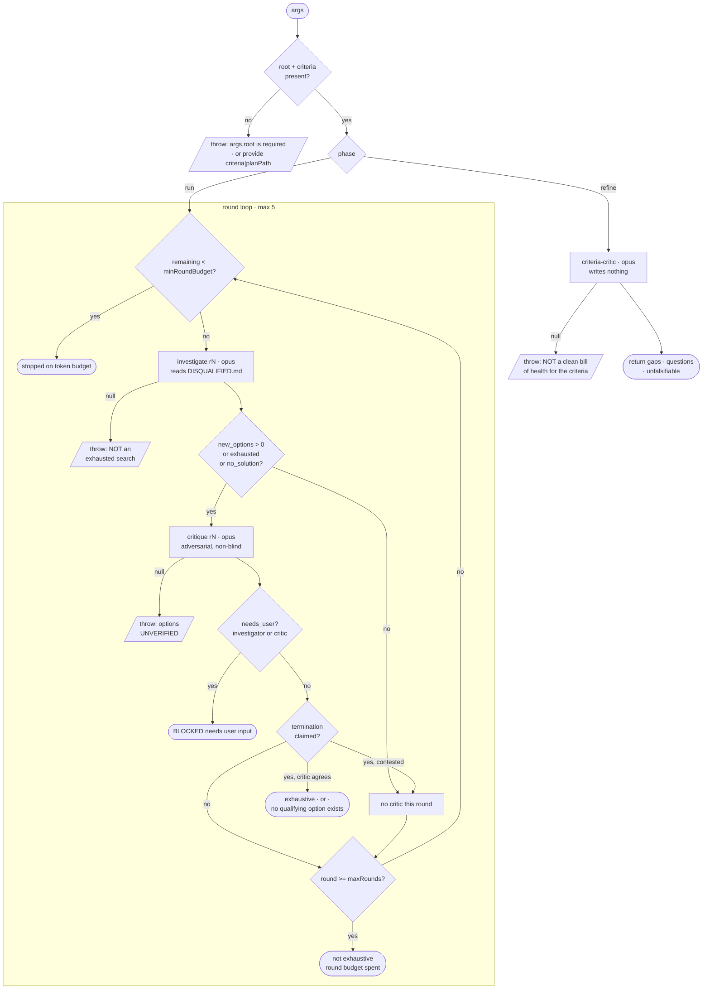

# Flow Maps — generated Mermaid flow diagrams per workflow

**Status: BUILT (2026-07-27).** All nine engines are mapped. `tools/gen-flows.mjs` + `tools/flows/*.flow.mjs`
generate `workflows/<x>/FLOW.md`; `tests/flow-coverage.test.mjs` gates them. See §10 for how §8's open
questions resolved and what the design got wrong.

**What:** a `FLOW.md` beside each workflow holding a Mermaid diagram of its complete agent flow — every
agent, gate, loop, throw, and terminal state — **generated deterministically** by running the engine under
the existing test harness with scripted agent returns. Ships to users so they can see what a run will
actually do before they start one.

**Tool:** `tools/gen-flows.mjs` (name mirrors `workflows/debug/gen-units.mjs` — both are plain Node, run
directly, **not** Workflow engines).

---

## 1. Why this is possible at all

This is the load-bearing insight, and it is a consequence of principles #1 and #8 rather than luck.

The harness "routes; it never re-interprets," and "thin structured returns drive the loop, rich content
lives in files." So **the entire control graph is ordinary JavaScript** and *none* of it is in the prompts:

| Layer | Lives in | Extractable |
|---|---|---|
| Nodes (agents), edges, gates, loop bounds, terminal states | the `.mjs` | Yes, fully |
| What each phase means | `meta.phases` — already authored, already a pure literal | Yes, already structured |
| What an agent judges by, how it decides | the prompts | No — and not needed for a flow diagram |

If agents chose what ran next, this would be impossible. The architecture forbids that, which is exactly
what makes it tractable. **If a future engine ever puts a routing decision in a prompt, this tool silently
stops being able to see it** — that is worth treating as a design smell in its own right.

## 2. Approach: trace the harness, do NOT parse the AST

Static analysis is the obvious approach and it is the wrong one here:

- Recovering loops, `break`s and conditional spawns needs a real control-flow-graph builder — a lot of
  fragile code for a doc generator.
- The engines are not valid ES modules (top-level `return`/`await`), so `node --check` and plain `import`
  both fail; a tolerant parser means adding a dependency to a repo that deliberately has none.
- An AST tells you what *could* happen. It cannot tell you what *does*, so it cannot confirm a path is
  actually reachable.

Instead, reuse `tests/harness.mjs`. It already loads the engine as text, rewrites `export const meta` to a
plain `const`, wraps the body with the harness globals injected, and passes an `agent()` that returns
**scripted objects** instead of spawning a model. It hands back:

```js
{ out, calls, logs, labels, prompt(prefix), byLabel(prefix) }
```

`labels` is the ordered sequence of agent calls. `byLabel(prefix).opts` carries that call's `phase`,
`schema` and `model`. `out.status` is the terminal state. That is a complete, verified path through the
graph — deterministic, no model calls, about a second per engine.

Each scenario is one named traversal. The union of scenarios is the graph.

## 3. Loops become easy, not hard

The concern that loops are tricky programmatically is correct for static analysis and **inverted** for
traces. A loop shows up as repeated label prefixes:

```
investigate r1 → critique r1 → investigate r2 → critique r2 → investigate r3
```

Collapse repeated labels into one node and draw a back-edge annotated with the condition you *scripted* to
cause the repeat (you know it, because you wrote the response that triggered it). You never infer the
loop — you watch it run, then fold it.

Loop bounds come from the same place: script a scenario that never satisfies the exit condition and the
trace terminates at `maxRounds`, giving you both the bound and the terminal state it produces.

## 4. It doubles as a linter — the part that pays for itself

Once traces exist, three assertions fall out that the current suite does not cover:

1. **Every terminal status is reachable.** Any entry in an engine's `HALT_STATUS` map that no scenario
   produces is either dead code or an untested exit.
2. **Every `agent()` label is spawned by some scenario.** An agent no trace reaches is uncovered.
3. **`meta.phases` matches the `phase()` calls that actually fire.** `meta` is pure documentation today
   and can drift from the code silently — nothing checks it.

(3) is the cheapest and most valuable: `meta.description`/`whenToUse`/`phases` is what the Workflow tool
shows at launch, and it is the one part of an engine with no verification at all.

## 5. Output format

**Mermaid.** Text, diffable, renders natively on GitHub and in Claude Code artifacts, zero dependencies.
`flowchart TD` with a subgraph per phase covers gates, loops and terminal states.

Worked example — `investigate-cycle`, accurate to the engine as built:



Each terminal state is a distinct end node — you can *see* that "ran out of rounds" and "nothing
qualifies" never merge, which is the property that matters most in this engine.

## 6. What the generator emits vs. what is hand-written

Generated (never hand-edited):

- the node/edge graph, from traces
- terminal states, from each scenario's `out.status`
- per-agent `model` and `phase`, from `byLabel().opts`

Layered on, from data that already exists:

- phase descriptions from `meta.phases` (authored, not invented)
- the scenario name as the edge label on each terminal path

Deliberately **not** attempted: the criteria an agent judges by. That lives in prompts, is prose, and does
not belong on a flowchart. `CLAUDE.md` already covers it.

## 7. Build order and honest cost

The real cost is the **scenario table** — roughly 100–150 lines per engine. The test files already contain
most of these scenarios but written as assertions, not a reusable table.

**Write a parallel scenario set rather than refactoring the tests.** The tests optimize for failure paths;
the flow tool wants complete terminal-state coverage. Those goals overlap but differ, and coupling them
would make both worse — a test deleted for being redundant would silently blank a branch of the diagram.

Suggested order:

1. `investigate` and `decide` first — simplest graphs, ~150 lines of tool. Confirm the output is worth
   reading before going further.
2. `docs`, `enhance`, `brainstorm`, `debug/review` — fan-outs; the diagram shape is different (parallel
   branches rather than a loop) and may need a second emitter mode.
3. The build loops (`feature`, `migrate`, `debug/resolve`) last. Much gnarlier: park, staging, the
   roadmap-continues-vs-run-stops asymmetry, and per-plan sub-loops. These are also where a diagram would
   be most valuable, which is the argument for not starting there.

## 8. Open questions — settle before building

- **`FLOW.md` per workflow, or one `principles/FLOWS.md`?** Alongside each is better for maintenance and
  for shipping to users; one file is better for spotting that two engines solve the same problem
  differently. Leaning per-workflow, with the comparison view as a possible later addition.
- **Committed, or generated on demand?** Committed renders on GitHub and is visible to users who never run
  the tool — but then it can drift. The §4 linter assertions are what keep a committed file honest, so
  this probably resolves to: commit them, and fail `node tests/run.mjs` when they are stale.
- **Do the linter assertions live in the tool or in the suite?** Putting them in `tests/` means drift
  breaks the gate, which is the point. Probably a `flows.test.mjs` that runs the tracer and asserts
  reachability + `meta.phases` agreement, with the tool itself only doing emission.
- **Diagram depth for the build loops.** One diagram per engine may be unreadable for `feature-cycle`
  (roadmap → per-plan loop → two review stages → park). Options: one overview plus a per-plan detail
  diagram, or collapse the inner loop into a single subgraph node.
- **Does this belong in the repo as a tool, or as a workflow?** It is deterministic and needs no model
  calls, so it is a tool (`gen-units.mjs` precedent) — but confirm nobody wants an agent writing prose
  around the diagrams, which would change the answer.

## 9. Prior art in this repo

- `workflows/debug/gen-units.mjs` — the precedent for plain-Node tooling: real imports, run directly,
  judged as ordinary code rather than by the engine rules (`tests/CLAUDE.md` §2).
- `tests/harness.mjs` — the tracing machinery already exists; this feature is mostly a consumer of it.
- `tests/README.md` — "the engine's control plane is a pure function of what its agents return." That
  sentence is the whole justification for this approach; a flow map is that function, drawn.

## 10. How it actually landed (2026-07-27)

**§8's open questions, resolved:**

- **`FLOW.md` per workflow**, beside each engine. debug needed two (`FLOW-review.md`, `FLOW-resolve.md`):
  two engines, two runs, two sets of terminal states, and a triage step between them that is deliberately
  not automatic.
- **Committed, and the suite fails when stale.** As §8 guessed, the linter assertions are what keep a
  committed file honest.
- **Assertions live in `tests/`** (`tests/flow-coverage.test.mjs`), emission in `tools/`. But they share
  ONE `buildGraph(spec)` call — computing coverage twice let the diagram's own coverage line disagree
  with the gate.
- **Build loops fit in one diagram after all.** feature is 26 nodes / 33 edges and readable, because
  role-folding plus a distinct "next item" edge does the compression a manual overview/detail split was
  meant to. No second emitter mode was needed.
- **A tool, not a workflow.** Confirmed — no prose, no model calls.

**Four things this design got wrong, all caught at refine before any code was written:**

1. **`meta.phases` must be measured against each call's `opts.phase`, not fired `phase()` calls.** §4
   named the check but not the signal. `review.mjs` and `enhance-cycle` never call `phase()`; `docs-cycle`
   calls it once against three declared phases. The naive check reports 3 of 9 engines as drifted and the
   "fix" is deleting correct launch documentation. Measured properly, all nine agree today.
2. **Five engines return no `status` at all** (brainstorm, review, enhance, docs, resolve), so §5's
   "one end node per terminal state" collapses their every non-throw exit into one blank node. Scenarios
   declare those terminals; `FLOW.md` marks each derived or declared so provenance stays visible.
3. **Throw terminals must key on the static throw SITE, not the message.** Three of investigate's six
   throw messages interpolate the round number, so dying in round 1 vs round 3 mints two nodes for one
   site — and breaks byte-stability.
4. **§3 was too optimistic about loops.** Folding is easy; *counting* is not. The repeat annotation has to
   be traversals of that edge along one lane, where a lane is one item's pass through the graph. Counting
   visits to the target node instead lets fan-out width and roadmap length inflate it — review read ×4
   for 2 lenses, docs ×3 for a 2-round loop, feature ×3 for a plan retried once.

**What §4's linter caught immediately, on engines nobody was editing — both since FIXED:**

- **`migrate-cycle` never read `gates_green`.** It was `required` in `PARK_SCHEMA`, demanded by the park
  prompt and printed in the run log, and no code consumed it — textbook attestation theater
  (`tests/CLAUDE.md` §3). A park that cleared the tree but left the build RED therefore fell through to
  the "tree is CLEAN; resolve with the user, then resume from this section" branch, telling the operator
  to resume into a broken build. Both siblings already halted on it (`feature-cycle.mjs:710`,
  `resolve-cycle.mjs:649`). Now a third `park-unsafe` branch, covered by `tests/migrate.test.mjs` and by
  a `red build after parking` scenario in the flow spec.
  **The diagram is what surfaced it**: feature drew three routes into `park-unsafe` and migrate only two.
- **`resolve-cycle.mjs:654` was unreachable** — every loop exit either sets a status or falls into the
  park block, which always sets one. The line stays as a guard for a future exit that forgets, but it no
  longer reports `needs-attention (loop end)`, which read as a plausible outcome; it now names itself an
  engine bug, the same way investigate handles an unmapped `haltKind`. `feature-cycle` and
  `migrate-cycle` initialise the same `'pending'` and had no guard at all, so both got the twin (§1).

Both are the class §1 predicted: things a per-unit reviewer structurally cannot see, which fall out of
drawing the whole control graph at once. Neither is testable as a *reachable* path — the first was
invisible because nothing read the field, the second because nothing can reach the line — which is
precisely why a coverage gate over the whole graph found them and the review loop did not.
