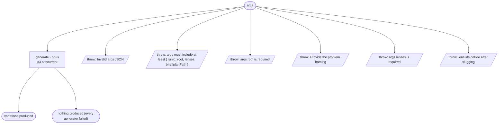

# brainstorm-cycle flow map

Generated by `node tools/gen-flows.mjs brainstorm`. **Do not hand-edit.**
Every node and edge below was *observed*: the scenarios in `tools/flows/` run the real engine
under the test harness with scripted agent returns, so this is what a run does rather than what
it might do. `node tools/gen-flows.mjs --check` fails the gate while this file is stale.

## Phases

| Phase | What happens |
|---|---|
| Generate | One generator per lens (CONCURRENT). Each reads the shared brief (verbatim) + its lens, produces a complete variation fully committed to that lens, and writes it into runs/&lt;runId&gt;/variations/&lt;lens&gt;/. Returns only the entry path + a one-line differentiator. No review, no staging. |

## Terminal states

| Terminal | Reached when | Source |
|---|---|---|
| variations produced | every generator returns a variation · one lens produces nothing | declared |
| nothing produced (every generator failed) | no lens produced anything | declared |
| throw: Invalid args JSON | args is a string that is not valid JSON | throw (line 24) |
| throw: args must include at least { runId, root, lenses, brief\|planPath } | args carry no runId | throw (line 27) |
| throw: args.root is required | args.root is missing | throw (line 30) |
| throw: Provide the problem framing | neither brief nor planPath | throw (line 59) |
| throw: args.lenses is required | args.lenses is empty | throw (line 74) |
| throw: lens ids collide after slugging | two lenses slug to one folder | throw (line 78) |

## Coverage

9 scenarios · 1/1 roles · 6/6 throw sites · 0/0 halt statuses · 8 terminal states.
