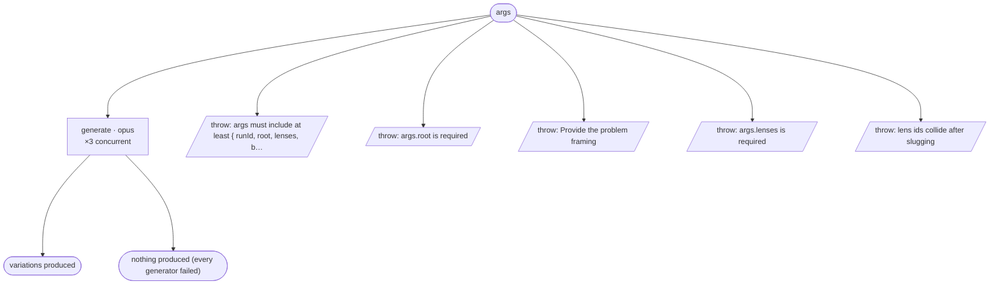

# brainstorm-cycle flow map

Generated by `node tools/gen-flows.mjs brainstorm`. **Do not hand-edit.**
Every node and edge below was *observed*: the scenarios in `tools/flows/` run the real engine
under the test harness with scripted agent returns, so this is what a run does rather than what
it might do. `node tools/gen-flows.mjs --check` fails the gate while this file is stale.

## Phases

| Phase | What happens |
|---|---|
| Generate | One generator per lens (CONCURRENT). Each reads the shared brief (verbatim) + its lens, produces a complete variation fully committed to that lens, and writes it into runs/&lt;runId&gt;/variations/&lt;lens&gt;/. Returns only the entry path + a one-line differentiator. No review, no staging. |

## Terminal states

| Terminal | Reached when | Source |
|---|---|---|
| variations produced |  | declared |
| nothing produced (every generator failed) |  | declared |
| throw: args must include at least { runId, root, lenses, b… |  | throw (line 20) |
| throw: args.root is required |  | throw (line 23) |
| throw: Provide the problem framing |  | throw (line 52) |
| throw: args.lenses is required |  | throw (line 67) |
| throw: lens ids collide after slugging |  | throw (line 71) |

## Coverage

8 scenarios · 1/1 roles · 5/5 throw sites · 0/0 halt statuses · 7 terminal states.
