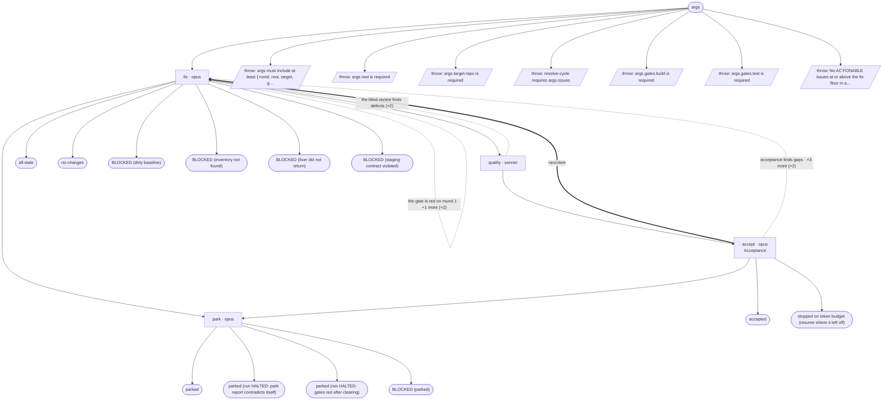

# debug/resolve-cycle — flow map

Generated by `node tools/gen-flows.mjs resolve` — **do not hand-edit**.
Every node and edge below was *observed*: the scenarios in `tools/flows/` run the real engine
under the test harness with scripted agent returns, so this is what a run does rather than what
it might do. `node tools/gen-flows.mjs --check` fails the gate while this file is stale.

## Phases

| Phase | What happens |
|---|---|
| Fix | Fixer reads its batch's issue file(s) verbatim, verify-first, fixes minimally, runs gates, leaves work UNSTAGED. Owns the decision matrix; halts only for a user-only decision. |
| Quality | BLIND pure-code critic: reads ONLY the unstaged diff (no issue text), flags defects the fix introduced or broke. Must be clean to proceed. |
| Acceptance | Issue-aware gate: re-derives each claimed fix's root cause from current code, confirms it is fully closed + no regression + gates green. Writes acceptance-review; on pass, STAGES the batch. |
| Park | On EITHER terminal outcome — round budget exhausted, or a fixer escalation that halts the run: SAVES the batch's work to parked-&lt;batch&gt;.patch, then clears it from the tree. Nothing is destroyed, every exit leaves a clean unstaged tree, and the batch is recorded in NEEDS-USER.md for the user to restore, retry, or drop. |

## Terminal states

| Terminal | Reached when | Source |
|---|---|---|
| accepted |  | declared |
| all-stale |  | declared |
| no-changes |  | declared |
| parked |  | declared |
| parked (run HALTED: park report contradicts itself) |  | declared |
| parked (run HALTED: gates red after clearing) |  | declared |
| BLOCKED (parked) |  | declared |
| BLOCKED (dirty baseline) |  | declared |
| BLOCKED (inventory not found) |  | declared |
| BLOCKED (fixer did not return) |  | declared |
| BLOCKED (staging contract violated) |  | declared |
| stopped on token budget (resume where it left off) |  | declared |
| throw: args must include at least { runId, root, target, g… |  | throw (line 23) |
| throw: args.root is required |  | throw (line 28) |
| throw: args.target.repo is required |  | throw (line 34) |
| throw: resolve-cycle requires args.issues |  | throw (line 411) |
| throw: args.gates.build is required |  | throw (line 417) |
| throw: args.gates.test is required |  | throw (line 420) |
| throw: No ACTIONABLE issues at or above the fix floor in a… |  | throw (line 430) |

## Coverage

23 scenarios · 4/4 roles · 7/7 throw sites · 0/0 halt statuses · 19 terminal states.
