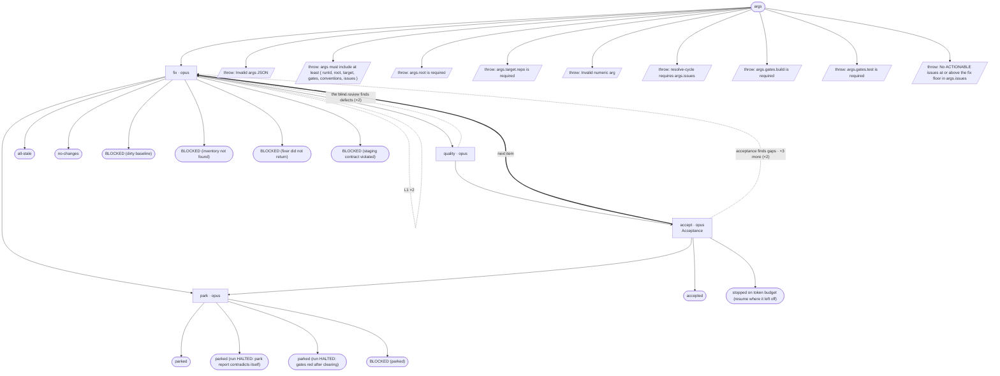

# debug/resolve-cycle flow map

Generated by `node tools/gen-flows.mjs resolve`. **Do not hand-edit.**
Every node and edge below was *observed*: the scenarios in `tools/flows/` run the real engine
under the test harness with scripted agent returns, so this is what a run does rather than what
it might do. `node tools/gen-flows.mjs --check` fails the gate while this file is stale.

## Phases

| Phase | What happens |
|---|---|
| Fix | Fixer reads its batch's issue file(s) verbatim, verify-first, fixes minimally, runs gates, leaves work UNSTAGED. Owns the decision matrix; halts only for a user-only decision. |
| Quality | BLIND pure-code critic: reads ONLY the unstaged diff (no issue text), flags defects the fix introduced or broke. Must be clean to proceed. |
| Acceptance | Issue-aware gate: re-derives each claimed fix's root cause from current code, confirms it is fully closed + no regression + gates green. Writes acceptance-review; on pass, STAGES the batch. |
| Park | On EITHER terminal outcome - round budget exhausted, or a fixer escalation that halts the run: SAVES the batch's work to parked-&lt;batch&gt;.patch, then clears it from the tree. Nothing is destroyed, every exit leaves a clean unstaged tree, and the batch is recorded in NEEDS-USER.md for the user to restore, retry, or drop. |

## Loops

| Loop | Agent | Repeats while |
|---|---|---|
| L1 | fix | the gate is red on round 1 · the gate is never green |

## Terminal states

| Terminal | Reached when | Source |
|---|---|---|
| accepted | both batches accept and stage · the gate is red on round 1 · the blind review finds defects · acceptance finds gaps | declared |
| all-stale | verify-first finds every issue already fixed | declared |
| no-changes | the fixer produced no change at all | declared |
| parked | the gate is never green · a batch does not accept within its round budget | declared |
| parked (run HALTED: park report contradicts itself) | park reports saved=false with bytes on disk | declared |
| parked (run HALTED: gates red after clearing) | the gates are red after the tree is cleared | declared |
| BLOCKED (parked) | the fixer hits a user-only blocker | declared |
| BLOCKED (dirty baseline) | the tree was not clean on round 1 | declared |
| BLOCKED (inventory not found) | the fixer finds no issue block in the inventory | declared |
| BLOCKED (fixer did not return) | the round-1 fixer returns nothing | declared |
| BLOCKED (staging contract violated) | the fixer never attests its work is unstaged | declared |
| stopped on token budget (resume where it left off) | too few tokens left to start the next batch | declared |
| throw: Invalid args JSON | args is a string that is not valid JSON | throw (line 27) |
| throw: args must include at least { runId, root, target, gates, conventions, issues } | args carry no runId | throw (line 30) |
| throw: args.root is required | args.root is missing | throw (line 35) |
| throw: args.target.repo is required | args.target.repo is missing | throw (line 41) |
| throw: Invalid numeric arg | maxRounds is not a number | throw (line 60) |
| throw: resolve-cycle requires args.issues | args.issues is missing | throw (line 433) |
| throw: args.gates.build is required | args.gates.build is missing | throw (line 439) |
| throw: args.gates.test is required | args.gates.test is missing | throw (line 442) |
| throw: No ACTIONABLE issues at or above the fix floor in args.issues | triage left no ACTIONABLE issue at the fix floor | throw (line 452) |

## Coverage

25 scenarios · 4/4 roles · 9/9 throw sites · 0/0 halt statuses · 21 terminal states.
