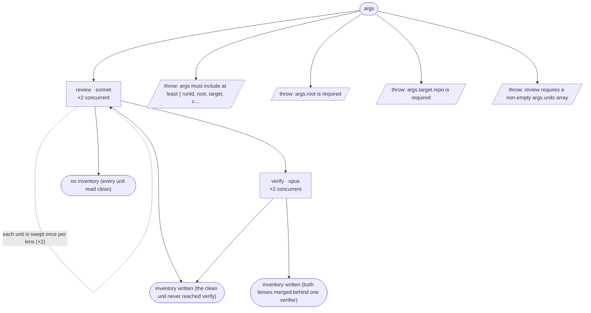

# debug/review — flow map

Generated by `node tools/gen-flows.mjs review` — **do not hand-edit**.
Every node and edge below was *observed*: the scenarios in `tools/flows/` run the real engine
under the test harness with scripted agent returns, so this is what a run does rather than what
it might do. `node tools/gen-flows.mjs --check` fails the gate while this file is stale.

## Phases

| Phase | What happens |
|---|---|
| Review | Reviewer finds production defects in ONE bounded unit (units run concurrently, read-only); when it finds nothing it writes the clean issues/&lt;unit&gt;.md marker itself. |
| Verify | Spawned ONLY for units with findings: confirms each against real code, corrects severity, routes via the decision matrix, and WRITES runs/&lt;runId&gt;/issues/&lt;unit&gt;.md verbatim (the inventory). Returns a slim verdict index. |

## Terminal states

| Terminal | Reached when | Source |
|---|---|---|
| inventory written (the clean unit never reached verify) |  | declared |
| no inventory (every unit read clean) |  | declared |
| inventory written (both lenses merged behind one verifier) |  | declared |
| throw: args must include at least { runId, root, target, c… |  | throw (line 20) |
| throw: args.root is required |  | throw (line 25) |
| throw: args.target.repo is required |  | throw (line 31) |
| throw: review requires a non-empty args.units array |  | throw (line 329) |

## Coverage

7 scenarios · 2/2 roles · 4/4 throw sites · 0/0 halt statuses · 7 terminal states.
