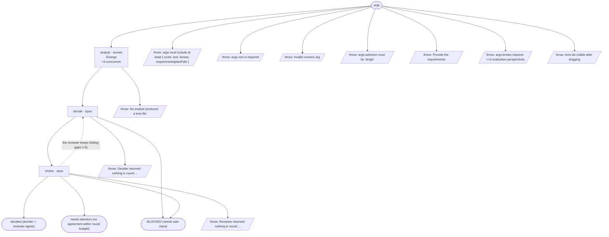

# decide-cycle flow map

Generated by `node tools/gen-flows.mjs decide`. **Do not hand-edit.**
Every node and edge below was *observed*: the scenarios in `tools/flows/` run the real engine
under the test harness with scripted agent returns, so this is what a run does rather than what
it might do. `node tools/gen-flows.mjs --check` fails the gate while this file is stale.

## Phases

| Phase | What happens |
|---|---|
| Diverge | One analyst per lens (CONCURRENT). Each reads the requirements (verbatim) + its lens, generates 2-4 options, scores them under its lens, recommends one, and writes lenses/&lt;lens&gt;.md. Returns a thin index. |
| Decide | The decider reads the requirements + every lens file (+ the latest review), combines the best elements, builds a GLOBAL weighted decision matrix enforcing the non-negotiables - every cell citing its lens evidence or marked own-judgment - picks the winner, and writes decision-rN.md. Returns the choice + a meets-all-requirements flag. |
| Review | A NON-BLIND adversarial reviewer reads the decision + requirements + lens files, checks every requirement is met and the matrix is sound (each citation verified against its lens file, no unsupported leap, no better option overlooked), and writes decision-review-rN.md. Agreement ends the loop; gaps drive another Decide round. |

## Terminal states

| Terminal | Reached when | Source |
|---|---|---|
| decided (decider + reviewer agree) | the reviewer agrees the conclusion holds · one analyst produces no lens file | derived |
| needs-attention (no agreement within round budget) | the reviewer keeps finding gaps | derived |
| BLOCKED (needs user input) | the decider hits a user-only call · the reviewer finds a requirement contradiction | derived |
| throw: args must include at least { runId, root, lenses, requirements\|planPath } | args carry no runId | throw (line 23) |
| throw: args.root is required | args.root is missing | throw (line 26) |
| throw: Invalid numeric arg | maxRounds is not a number | throw (line 45) |
| throw: args.selection must be 'single' | selection is neither single nor ranked | throw (line 63) |
| throw: Provide the requirements | neither requirements nor planPath | throw (line 93) |
| throw: args.lenses requires &gt;=2 evaluation perspectives | fewer than two lenses | throw (line 104) |
| throw: lens ids collide after slugging | two lenses slug to one file | throw (line 108) |
| throw: No analyst produced a lens file | no analyst produced a lens file | throw (line 295) |
| throw: Decider returned nothing in round ... | the decider dies | throw (line 326) |
| throw: Reviewer returned nothing in round ... | the reviewer dies | throw (line 349) |

## Coverage

15 scenarios · 3/3 roles · 10/10 throw sites · 0/0 halt statuses · 13 terminal states.
