# develop-cycle flow map

Generated by `node tools/gen-flows.mjs develop`. **Do not hand-edit.**
Every node and edge below was *observed*: the scenarios in `tools/flows/` run the real engine
under the test harness with scripted agent returns, so this is what a run does rather than what
it might do. `node tools/gen-flows.mjs --check` fails the gate while this file is stale.

```mermaid
%%{init: {"flowchart": {"nodeSpacing": 80, "rankSpacing": 200}}}%%
flowchart TD
  S0(["args"])
  a1["develop · opus"]
  a2["quality · opus"]
  a3["acceptance · opus"]
  a4["park · opus"]
  a5["final-sweep · sonnet<br/>Sweep"]
  t1(["done (all blocks staged)"])
  t2(["partial slice complete"])
  t3(["nothing to run (no todo blocks)"])
  t4(["run complete with N block(s) parked"])
  t5(["halted (a block was parked - its work is saved to a patch; the blocks after it were not attempted)"])
  t6(["BLOCKED (a fix block printed no issue entries - check its planPath and block id; nothing was built)"])
  t7(["run complete with N block(s) blocked"])
  t8(["halted (a fix block closed no issue - every entry was skipped or stale, and the ordered run stopped there)"])
  t9(["BLOCKED (a block passed but was not staged - stage it, then resume)"])
  t10(["BLOCKED (a block staged while self-reporting a regression - inspect the staged diff before continuing)"])
  t11(["BLOCKED (the developer did not confirm its work stayed unstaged - the staged index is surface neither reviewer checks; inspect git diff --cached before resuming)"])
  t12(["BLOCKED (an agent could not obtain its plan - nothing was built from a guess)"])
  t13(["BLOCKED (an agent returned nothing - it was skipped or died; its work is parked)"])
  t14(["BLOCKED (working tree was not clean - nothing was built)"])
  t15(["BLOCKED (needs user input)"])
  t16(["BLOCKED (a parked block left the tree unsafe - inspect before resuming)"])
  t17(["stopped on token budget (resume where it left off)"])
  x1[/"throw: Invalid args JSON"/]
  x2[/"throw: args.plans must be a NON-EMPTY array of { id, planPath, mode, gate, status } entries"/]
  x3[/"throw: args must include at least { runId, root, target, gates, plans:[{id, planPath, mode, gate, status}] }"/]
  x4[/"throw: args.root is required"/]
  x5[/"throw: args.target.repo is required"/]
  x6[/"throw: Invalid numeric arg"/]
  x7[/"throw: Invalid ordered key"/]
  x8[/"throw: Invalid suite key"/]
  x9[/"throw: Invalid sweep key"/]
  x10[/"throw: Invalid goal key"/]
  x11[/"throw: Missing goal key"/]
  x12[/"throw: plans entries at index [...] are not objects carrying a string id"/]
  x13[/"throw: plan id(s) [...] are not kebab slugs"/]
  x14[/"throw: plan mode(s) [...] are not one of feature #124; section #124; fix"/]
  x15[/"throw: pass entries [...] are malformed"/]
  x16[/"throw: plan gate(s) [...] are not legal for their block's mode"/]
  x17[/"throw: plan status(es) [...] are not one of todo #124; done #124; skip #124; parked #124; blocked"/]
  x18[/"throw: plans [...] carry no planPath and there is no top-level planPath to default to"/]
  x19[/"throw: duplicate plan id(s) [...] in args.plans"/]
  x20[/"throw: args.gates.build is required"/]
  x21[/"throw: Invalid slice arg"/]
  x22[/"throw: args.runOnly ... matches no plan id"/]
  x23[/"throw: args.startAt #quot;...#quot; matches no plan id"/]
  x24[/"throw: args.gates.test is required when any block being built has gate:#quot;green#quot;"/]
  S0 --> a1
  S0 --> t3
  S0 --> x1
  S0 --> x2
  S0 --> x3
  S0 --> x4
  S0 --> x5
  S0 --> x6
  S0 --> x7
  S0 --> x8
  S0 --> x9
  S0 --> x10
  S0 --> x11
  S0 --> x12
  S0 --> x13
  S0 --> x14
  S0 --> x15
  S0 --> x16
  S0 --> x17
  S0 --> x18
  S0 --> x19
  S0 --> x20
  S0 --> x21
  S0 --> x22
  S0 --> x23
  S0 --> x24
  a1 -.->|"L1 ×4"| a1
  a1 ==>|"next item"| a1
  a1 --> a2
  a1 --> a3
  a1 --> a4
  a1 --> t6
  a1 --> t8
  a1 --> t14
  a2 -.->|"the blind review finds defects (×2)"| a1
  a2 --> a3
  a2 --> a4
  a3 ==> a1
  a3 -.->|"E1 ×4"| a1
  a3 --> a4
  a3 --> a5
  a3 --> t1
  a3 --> t2
  a3 --> t4
  a3 --> t7
  a3 --> t9
  a3 --> t10
  a3 --> t17
  a4 ==>|"next item"| a1
  a4 --> t4
  a4 --> t5
  a4 --> t11
  a4 --> t12
  a4 --> t13
  a4 --> t15
  a4 --> t16
  a5 --> t1
```

## Phases

| Phase | What happens |
|---|---|
| Develop | Developer reads its own block (verbatim, via the plan-block command) + the latest review that flagged issues; implements minimally, runs the gate, leaves changes UNSTAGED. Owns the decision matrix; halts only for a user-only decision. |
| Quality | BLIND pure-code critic: reads ONLY the unstaged diff (no plan, no spec, no goal), flags production-blocking defects, writes quality-review-&lt;id&gt;-rN.md. Must be clean to proceed. Skipped only for a block that has produced nothing AND has no review still open. |
| Acceptance | Plan-aware gate: every acceptance criterion of THIS block met + reachable + the block gate satisfied + no regression. Writes acceptance-review-&lt;id&gt;-rN.md; on pass, STAGES that block (git add, never commit) - the accepted baseline advances. |
| Park | On a block that did not accept within its round budget, or one the developer escalated: SAVES its work to parked-&lt;id&gt;.patch, then clears it from the tree. An UNORDERED run then continues; an ORDERED one stops. Nothing is destroyed - NEEDS-USER.md carries the restore command. |
| Sweep | Only when the plan file asks for it (sweep: goal-coverage) and every non-skip block is done: an independent agent re-greps the whole surface from the GOAL, runs the full gates, spot-checks the staged diff, writes SWEEP.md. Advisory - a dead sweep never halts. |

## Loops

| Loop | Agent | Repeats while |
|---|---|---|
| L1 | develop | the block gate is never green |

## Edges

| Edge | From | To | Taken when |
|---|---|---|---|
| E1 | acceptance | develop | acceptance finds gaps · a block parks and ordered is false · a block parks and ordered is true · park could not clear the tree · park reports saved=false with bytes on disk · the build is red after parking |

The thick unlabelled edge of each pair above is the next-item advance (the unit boundary).

## Terminal states

| Terminal | Reached when | Source |
|---|---|---|
| done (all blocks staged) | every block accepts and the sweep runs · the whole-goal sweep dies · sweep:none on a fully accepted run · the blind review finds defects · acceptance finds gaps · the developer changed no files · a fix block fixes an issue and accepts · a packed pass of two fix blocks fixes its issues and accepts · every issue in a fix block is stale | derived |
| partial slice complete | runOnly builds a subset of the blocks | derived |
| nothing to run (no todo blocks) | no block still has status todo | derived |
| run complete with N block(s) parked | the block gate is never green · a block parks and ordered is false | derived |
| halted (a block was parked - its work is saved to a patch; the blocks after it were not attempted) | a block parks and ordered is true | derived |
| BLOCKED (a fix block printed no issue entries - check its planPath and block id; nothing was built) | a fix block printed no issue entries | derived |
| run complete with N block(s) blocked | a fix block closes nothing and ordered is false | derived |
| halted (a fix block closed no issue - every entry was skipped or stale, and the ordered run stopped there) | a fix block closes nothing and ordered is true | derived |
| BLOCKED (a block passed but was not staged - stage it, then resume) | acceptance passes without staging | derived |
| BLOCKED (a block staged while self-reporting a regression - inspect the staged diff before continuing) | acceptance stages while reporting a regression | derived |
| BLOCKED (the developer did not confirm its work stayed unstaged - the staged index is surface neither reviewer checks; inspect git diff --cached before resuming) | the developer will not confirm its work stayed unstaged | derived |
| BLOCKED (an agent could not obtain its plan - nothing was built from a guess) | the developer reports plan_obtained=false · the acceptance verifier reports plan_obtained=false | derived |
| BLOCKED (an agent returned nothing - it was skipped or died; its work is parked) | the developer agent dies · the blind quality reviewer dies · the acceptance verifier dies | derived |
| BLOCKED (working tree was not clean - nothing was built) | the tree was not clean on round 1 | derived |
| BLOCKED (needs user input) | the developer hits a user-only blocker | derived |
| BLOCKED (a parked block left the tree unsafe - inspect before resuming) | park could not clear the tree · park reports saved=false with bytes on disk · the build is red after parking | derived |
| stopped on token budget (resume where it left off) | too few tokens left to start the next block | derived |
| throw: Invalid args JSON | args is a string that is not valid JSON | throw (line 23) |
| throw: args.plans must be a NON-EMPTY array of { id, planPath, mode, gate, status } entries | the --list object is pasted in whole | throw (line 28) |
| throw: args must include at least { runId, root, target, gates, plans:[{id, planPath, mode, gate, status}] } | a plans array arrives with no runId | throw (line 31) |
| throw: args.root is required | args.root is missing | throw (line 35) |
| throw: args.target.repo is required | args.target.repo is missing | throw (line 39) |
| throw: Invalid numeric arg | maxRounds is not a number | throw (line 52) |
| throw: Invalid ordered key | ordered is the string "false" | throw (line 97) |
| throw: Invalid suite key | suite is outside green \| scoped | throw (line 102) |
| throw: Invalid sweep key | sweep is outside goal-coverage \| none | throw (line 107) |
| throw: Invalid goal key | goal is a number | throw (line 111) |
| throw: Missing goal key | sweep is goal-coverage and goal is empty | throw (line 116) |
| throw: plans entries at index [...] are not objects carrying a string id | a plans entry carries no id | throw (line 134) |
| throw: plan id(s) [...] are not kebab slugs | a plans entry id is not a kebab slug | throw (line 142) |
| throw: plan mode(s) [...] are not one of feature \| section \| fix | a block asks for an unknown mode | throw (line 149) |
| throw: pass entries [...] are malformed | a pass entry is not mode fix with two or more members | throw (line 160) |
| throw: plan gate(s) [...] are not legal for their block's mode | a feature block asks for gate red-baseline | throw (line 168) |
| throw: plan status(es) [...] are not one of todo \| done \| skip \| parked \| blocked | a block names an unknown status | throw (line 176) |
| throw: plans [...] carry no planPath and there is no top-level planPath to default to | no entry and no top-level planPath | throw (line 192) |
| throw: duplicate plan id(s) [...] in args.plans | two plans entries share one id | throw (line 203) |
| throw: args.gates.build is required | args.gates.build is missing | throw (line 875) |
| throw: Invalid slice arg | runOnly is a bare block id string | throw (line 887) |
| throw: args.runOnly ... matches no plan id | runOnly holds an unknown block id | throw (line 894) |
| throw: args.startAt "..." matches no plan id | startAt is an unknown block id | throw (line 901) |
| throw: args.gates.test is required when any block being built has gate:"green" | a todo block wants gate green with no test command | throw (line 910) |

## Coverage

55 scenarios · 5/5 roles · 24/24 throw sites · 12/12 halt statuses · 41 terminal states.
