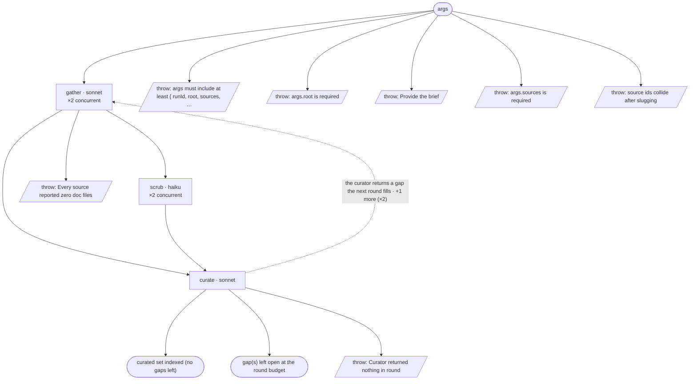

# docs-cycle — flow map

Generated by `node tools/gen-flows.mjs docs` — **do not hand-edit**.
Every node and edge below was *observed*: the scenarios in `tools/flows/` run the real engine
under the test harness with scripted agent returns, so this is what a run does rather than what
it might do. `node tools/gen-flows.mjs --check` fails the gate while this file is stale.

## Phases

| Phase | What happens |
|---|---|
| Gather | One gatherer per source (CONCURRENT). Each copies its brief-relevant slice VERBATIM into &lt;outDir&gt;/&lt;source&gt;/ — one file per page/topic, each with a source header (URL or path, version, retrieval date). Subtraction at capture: skip nav, marketing, other versions, features the brief does not touch. Returns thin counts. |
| Scrub | One scrubber per source (pipelined off its gather — no barrier). Cleans the source dir IN PLACE: removes capture junk (nav/menu fragments, cookie banners, feedback widgets, broken markup), fixes mangled markdown formatting, changes no words, keeps source headers. Unsure → keep; the curator judges relevance. |
| Curate | One curator reads the WHOLE set: organizes + splits at heading boundaries (text moves verbatim), deletes what the brief does not need (outDir is a dedicated, engine-owned folder for THIS doc set — anything it finds there that this run neither captured nor wrote is left alone and reported), writes INDEX.md (one line per file + Coverage notes holding cross-source inconsistencies and open gaps), then spot-checks up to fidelitySample files against the source cited in their own header. Gaps it returns (missing coverage, or a recapture — wrong version, failed spot-check) spawn a bounded gap-fill Gather round (maxRounds). |

## Terminal states

| Terminal | Reached when | Source |
|---|---|---|
| curated set indexed (no gaps left) |  | declared |
| gap(s) left open at the round budget |  | declared |
| throw: args must include at least { runId, root, sources, … |  | throw (line 37) |
| throw: args.root is required |  | throw (line 40) |
| throw: Provide the brief |  | throw (line 71) |
| throw: args.sources is required |  | throw (line 84) |
| throw: source ids collide after slugging |  | throw (line 88) |
| throw: Every source reported zero doc files |  | throw (line 278) |
| throw: Curator returned nothing in round |  | throw (line 291) |

## Coverage

12 scenarios · 3/3 roles · 7/7 throw sites · 0/0 halt statuses · 9 terminal states.
