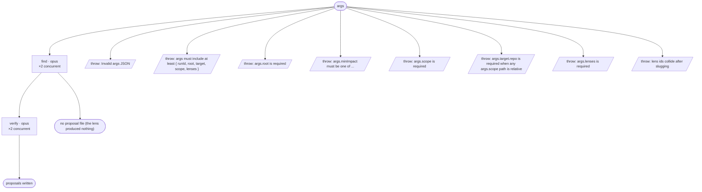

# enhance-cycle flow map

Generated by `node tools/gen-flows.mjs enhance`. **Do not hand-edit.**
Every node and edge below was *observed*: the scenarios in `tools/flows/` run the real engine
under the test harness with scripted agent returns, so this is what a run does rather than what
it might do. `node tools/gen-flows.mjs --check` fails the gate while this file is stale.

## Phases

| Phase | What happens |
|---|---|
| Find | One finder per lens (CONCURRENT), each reading the WHOLE scope through its lens. Grounded candidates only: what the system does today (file:line) -&gt; what it would do instead -&gt; the concrete cost that removes. A lens that finds nothing writes its own clean proposals/&lt;lens&gt;.md marker. |
| Verify | Spawned ONLY for lenses with candidates: re-checks each against the real code, REJECTS anything the system already does / any unsubstantiated benefit / any nit / anything that is really a defect, scores impact x effort, routes ADOPT \| ROADMAP \| NEEDS_USER \| REJECT, and WRITES proposals/&lt;lens&gt;.md verbatim. |

## Terminal states

| Terminal | Reached when | Source |
|---|---|---|
| proposals written | both finders return candidates above the floor | declared |
| no proposal file (the lens produced nothing) | the finder dies · every candidate scores below the impact floor | declared |
| throw: Invalid args JSON | args is a string that is not valid JSON | throw (line 38) |
| throw: args must include at least { runId, root, target, scope, lenses } | args carry no runId | throw (line 41) |
| throw: args.root is required | args.root is missing | throw (line 45) |
| throw: args.minImpact must be one of ... | args.minImpact names no rank | throw (line 59) |
| throw: args.scope is required | args.scope is empty | throw (line 104) |
| throw: args.target.repo is required when any args.scope path is relative | a scope path is relative and target.repo is missing | throw (line 110) |
| throw: args.lenses is required | args.lenses is empty | throw (line 120) |
| throw: lens ids collide after slugging | two lenses slug to one id | throw (line 124) |

## Coverage

11 scenarios · 2/2 roles · 8/8 throw sites · 0/0 halt statuses · 10 terminal states.
