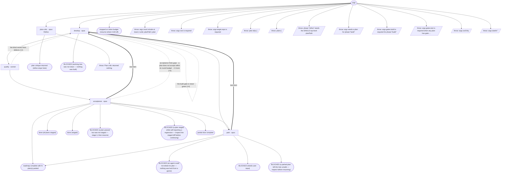

# feature-cycle — flow map

Generated by `node tools/gen-flows.mjs feature` — **do not hand-edit**.
Every node and edge below was *observed*: the scenarios in `tools/flows/` run the real engine
under the test harness with scripted agent returns, so this is what a run does rather than what
it might do. `node tools/gen-flows.mjs --check` fails the gate while this file is stale.

## Phases

| Phase | What happens |
|---|---|
| Refine | MANDATORY first pass (refine phase only): an independent critic greps the repo, verifies the plan against real code, returns gaps + blocking questions to the orchestrating agent. Writes nothing. |
| Develop | Developer reads the approved plan (verbatim) + the latest review that flagged issues; implements minimally, runs the gate to green, leaves changes UNSTAGED. Owns the decision matrix; halts only for a user-only decision. |
| Quality | BLIND pure-code critic: reads ONLY the unstaged diff (no plan, no spec, no goal), flags production-blocking defects, writes quality-review-&lt;id&gt;-rN.md. Must be clean to proceed. |
| Acceptance | Plan-aware gate: every acceptance criterion met + feature reachable + full gates green + no regression. Writes acceptance-review-&lt;id&gt;-rN.md; on pass, STAGES that feature (git add, never commit) — the accepted baseline advances plan by plan. |
| Park | On a plan that did not accept within its round budget, or one the developer escalated: SAVES that plan's work to parked-&lt;id&gt;.patch, then clears it from the tree. A budget-exhausted plan is parked and the ROADMAP CONTINUES (the next plan's blind diff is clean again); an escalation still stops the run, but leaves the tree clean either way. Nothing is destroyed — NEEDS-USER.md carries the restore command. |

## Terminal states

| Terminal | Reached when | Source |
|---|---|---|
| plan critique returned (refine stops here) |  | declared |
| done (all plans staged) |  | derived |
| done (staged) |  | derived |
| roadmap complete with N plan(s) parked |  | derived |
| BLOCKED (a plan passed but was not staged — stage it, then resume) |  | derived |
| BLOCKED (a plan staged while self-reporting a regression — inspect the staged diff before continuing) |  | derived |
| BLOCKED (an agent could not obtain its plan — nothing was built from a guess) |  | derived |
| BLOCKED (working tree was not clean — nothing was built) |  | derived |
| BLOCKED (needs user input) |  | derived |
| BLOCKED (a parked plan left the tree unsafe — inspect before resuming) |  | derived |
| stopped on token budget (resume where it left off) |  | derived |
| partial slice complete |  | derived |
| throw: args must include at least { runId, planPath \| plan |  | throw (line 26) |
| throw: args.root is required |  | throw (line 31) |
| throw: args.target.repo is required |  | throw (line 37) |
| throw: plan id(s) [ |  | throw (line 123) |
| throw: plans [ |  | throw (line 132) |
| throw: phase:"refine" needs the SINGLE top-level planPath |  | throw (line 480) |
| throw: Plan critic returned nothing |  | throw (line 492) |
| throw: args needs a plan for phase:"build" |  | throw (line 524) |
| throw: args.gates.build is required for phase:"build" |  | throw (line 530) |
| throw: args.gates.test is required when any plan has gate:… |  | throw (line 533) |
| throw: args.runOnly |  | throw (line 548) |
| throw: args.startAt " |  | throw (line 553) |

## Coverage

30 scenarios · 5/5 roles · 12/12 throw sites · 7/7 halt statuses · 24 terminal states.
