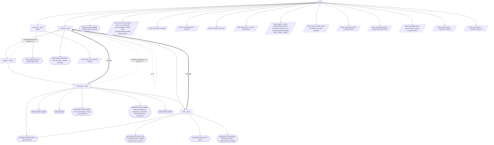

# feature-cycle flow map

Generated by `node tools/gen-flows.mjs feature`. **Do not hand-edit.**
Every node and edge below was *observed*: the scenarios in `tools/flows/` run the real engine
under the test harness with scripted agent returns, so this is what a run does rather than what
it might do. `node tools/gen-flows.mjs --check` fails the gate while this file is stale.

## Phases

| Phase | What happens |
|---|---|
| Refine | MANDATORY first pass (refine phase only): an independent critic greps the repo, verifies the plan against real code, returns gaps + blocking questions to the orchestrating agent. Writes nothing. |
| Develop | Developer reads the approved plan (verbatim) + the latest review that flagged issues; implements minimally, runs the gate to green, leaves changes UNSTAGED. Owns the decision matrix; halts only for a user-only decision. |
| Quality | BLIND pure-code critic: reads ONLY the unstaged diff (no plan, no spec, no goal), flags production-blocking defects, writes quality-review-&lt;id&gt;-rN.md. Must be clean to proceed. |
| Acceptance | Plan-aware gate: every acceptance criterion met + feature reachable + full gates green + no regression. Writes acceptance-review-&lt;id&gt;-rN.md; on pass, STAGES that feature (git add, never commit) - the accepted baseline advances plan by plan. |
| Park | On a plan that did not accept within its round budget, or one the developer escalated: SAVES that plan's work to parked-&lt;id&gt;.patch, then clears it from the tree. A budget-exhausted plan is parked and the ROADMAP CONTINUES (the next plan's blind diff is clean again); an escalation still stops the run, but leaves the tree clean either way. Nothing is destroyed - NEEDS-USER.md carries the restore command. |

## Loops

| Loop | Agent | Repeats while |
|---|---|---|
| L1 | develop | the build gate is never green |

## Terminal states

| Terminal | Reached when | Source |
|---|---|---|
| plan critique returned (refine stops here) | phase:"refine" | declared |
| done (all plans staged) | acceptance passes and stages · the blind review finds defects · acceptance finds gaps | derived |
| done (staged) | a single top-level plan accepts | derived |
| roadmap complete with N plan(s) parked | the build gate is never green · a plan does not accept within its round budget | derived |
| BLOCKED (a plan passed but was not staged - stage it, then resume) | acceptance passes without staging | derived |
| BLOCKED (a plan staged while self-reporting a regression - inspect the staged diff before continuing) | acceptance stages while reporting a regression | derived |
| BLOCKED (an agent could not obtain its plan - nothing was built from a guess) | the developer reports plan_obtained=false · the acceptance verifier reports plan_obtained=false | derived |
| BLOCKED (working tree was not clean - nothing was built) | the tree was not clean on round 1 | derived |
| BLOCKED (needs user input) | the developer hits a user-only blocker | derived |
| BLOCKED (a parked plan left the tree unsafe - inspect before resuming) | park could not clear the tree · park reports saved=false with bytes on disk · the build gate is red after parking | derived |
| stopped on token budget (resume where it left off) | too few tokens left to start a plan | derived |
| partial slice complete | runOnly builds a subset of the roadmap | derived |
| throw: args must include at least { runId, planPath \| plan (markdown string) \| plans:[{id,planPath\|plan,gate}], target, gates } | args carry neither runId nor a plan | throw (line 26) |
| throw: args.root is required | args.root is missing | throw (line 31) |
| throw: args.target.repo is required | args.target.repo is missing | throw (line 37) |
| throw: Invalid numeric arg | maxRounds is not a number | throw (line 58) |
| throw: plan id(s) [...] are not kebab slugs | a plans entry id is not a kebab slug | throw (line 140) |
| throw: plans [...] carry neither planPath nor an inline plan, and there is no top-level planPath holding their "## Plan: &lt;id&gt;" blocks | plans entries carry no body and there is no top-level planPath | throw (line 149) |
| throw: phase:"refine" needs the SINGLE top-level planPath | phase:"refine" with only the plans array | throw (line 497) |
| throw: Plan critic returned nothing | the plan critic dies | throw (line 509) |
| throw: args needs a plan for phase:"build" | every plans entry is missing its id | throw (line 541) |
| throw: args.gates.build is required for phase:"build" | args.gates.build is missing | throw (line 547) |
| throw: args.gates.test is required when any plan has gate:"green" | a plan asks for gate:"green" with no test command | throw (line 550) |
| throw: args.runOnly ... matches no plan id | runOnly holds an unknown plan id | throw (line 565) |
| throw: args.startAt "..." matches no plan id | startAt is an unknown plan id | throw (line 570) |

## Coverage

31 scenarios · 5/5 roles · 13/13 throw sites · 7/7 halt statuses · 25 terminal states.
