# gauntlet-cycle flow map

Generated by `node tools/gen-flows.mjs gauntlet`. **Do not hand-edit.**
Every node and edge below was *observed*: the scenarios in `tools/flows/` run the real engine
under the test harness with scripted agent returns, so this is what a run does rather than what
it might do. `node tools/gen-flows.mjs --check` fails the gate while this file is stale.

```mermaid
%%{init: {"flowchart": {"nodeSpacing": 80, "rankSpacing": 200}}}%%
flowchart TD
  S0(["args"])
  a1["critic · opus<br/>Critique"]
  a2["improve · opus"]
  a3["code-gate · opus<br/>Gate"]
  a4["park · opus"]
  a5["build · opus"]
  t1(["done (MVP staged)"])
  t2(["BLOCKED (component parked - MVP incomplete; resolve before refining)"])
  t3(["BLOCKED (a component passed clean but was not staged - stage it, then resume from the next component)"])
  t4(["BLOCKED (working tree was not clean - nothing was built)"])
  t5(["BLOCKED (an agent could not obtain its component spec - nothing was built from a guess)"])
  t6(["BLOCKED (environment fault - see NEEDS-USER.md)"])
  t7(["BLOCKED (an agent returned nothing - it was skipped or died; re-invoke to replay it)"])
  t8(["BLOCKED (a parked component left the tree unsafe - inspect before resuming)"])
  t9(["stopped on token budget (resume where it left off)"])
  t10(["done (all aspects closed)"])
  t11(["cycles spent (N aspect(s) open - resume with more cycles)"])
  t12(["done (this runOnly slice closed - N aspect(s) outside the slice were not climbed)"])
  t13(["BLOCKED (wave parked - its diff never cleared the code gate; resolve before climbing further)"])
  t14(["BLOCKED (a parked wave left the tree unsafe - inspect before resuming)"])
  x1[/"throw: Invalid args JSON"/]
  x2[/"throw: args must include at least { runId, root, target:{repo}, canonPath, componentsPath, components:[{id,gate}], gates:{build} }"/]
  x3[/"throw: args.root is required"/]
  x4[/"throw: args.target.repo is required"/]
  x5[/"throw: Unknown phase #quot;...#quot;"/]
  x6[/"throw: Invalid numeric arg"/]
  x7[/"throw: args.canonPath is required"/]
  x8[/"throw: args.componentsPath is required for phase:#quot;mvp#quot;"/]
  x9[/"throw: args.aspectsPath is required for phase:#quot;refine#quot;"/]
  x10[/"throw: args.barPath is required for phase:#quot;refine#quot;"/]
  x11[/"throw: args.components is required for phase:#quot;mvp#quot;"/]
  x12[/"throw: component id(s) [...] are not kebab slugs"/]
  x13[/"throw: duplicate component id(s) [...] in args.components"/]
  x14[/"throw: args.aspects is required for phase:#quot;refine#quot;"/]
  x15[/"throw: aspect id(s) [...] are not kebab slugs"/]
  x16[/"throw: duplicate aspect id(s) [...] in args.aspects"/]
  x17[/"throw: args.cycles is required for phase:#quot;refine#quot;"/]
  x18[/"throw: args.gates.build is required"/]
  x19[/"throw: args.gates.test is required when any component has gate:#quot;green#quot;"/]
  x20[/"throw: args.runOnly holds unknown aspect id(s) ..."/]
  x21[/"throw: args.runOnly ... matches no component id"/]
  x22[/"throw: args.startAt #quot;...#quot; matches no component id"/]
  S0 --> a1
  S0 --> a5
  S0 --> t9
  S0 --> x1
  S0 --> x2
  S0 --> x3
  S0 --> x4
  S0 --> x5
  S0 --> x6
  S0 --> x7
  S0 --> x8
  S0 --> x9
  S0 --> x10
  S0 --> x11
  S0 --> x12
  S0 --> x13
  S0 --> x14
  S0 --> x15
  S0 --> x16
  S0 --> x17
  S0 --> x18
  S0 --> x19
  S0 --> x20
  S0 --> x21
  S0 --> x22
  a1 ==>|"next item"| a1
  a1 --> a2
  a1 --> t4
  a1 --> t6
  a1 --> t7
  a1 --> t10
  a1 --> t12
  a2 ==>|"next item"| a1
  a2 ==>|"next item"| a2
  a2 -.->|"L1 ×2"| a2
  a2 ==>|"next item"| a3
  a2 --> a3
  a2 --> a4
  a2 ==>|"next item"| a4
  a3 ==>|"next item"| a1
  a3 -.->|"the code gate finds defects in the wave diff · +2 more (×3)"| a2
  a3 --> a4
  a3 ==> a5
  a3 -.->|"E1 ×4"| a5
  a3 --> t1
  a3 --> t3
  a3 --> t11
  a4 --> t2
  a4 --> t5
  a4 --> t6
  a4 --> t7
  a4 --> t8
  a4 --> t13
  a4 --> t14
  a5 --> a3
  a5 --> a4
  a5 -.->|"L2 ×4"| a5
  a5 --> t4
```

## Phases

| Phase | What happens |
|---|---|
| Build | Builder reads its component block (verbatim, via the plan-block command), CANON.md, BAR.md and the latest code review that flagged issues; implements to the quality frame, runs the gate to green, leaves changes UNSTAGED. Owns every judgment call: it settles ambiguity itself and logs it, and escalates NOTHING except an environment fault. |
| Gate | BLIND code gate: reads ONLY the unstaged diff (no canon, no bar, no spec, no goal), flags production-blocking defects AND structural debt, writes code-review-&lt;unit&gt;-rN.md. On a clean pass it is the staging agent (git add, never commit) and the accepted baseline advances one component - or, in refine, one whole wave. |
| Park | On a component that did not pass the code gate within its round budget, a refine wave that could not gate-clean, or work the run halted mid-flight: SAVES that unit's work to parked-&lt;unit&gt;.patch, then clears it from the tree so the repo is left clean and buildable. The run STOPS either way - what comes after it builds on it - but nothing is destroyed: NEEDS-USER.md carries the restore command. |
| Critique | Refine only. One fresh critic per open aspect per wave: OBSERVES the running product the way its ASPECTS.md section says to (building whatever tooling it needs in the testbed, read-only on the repo), A/Bs it against BAR.md, checks CANON, and writes critique-&lt;aspect&gt;-wN.md naming the ONE largest gap with its evidence. Reads SETTLED.md so it never re-opens a closed call, never a prior critique. Returns behind \| achieved \| saturated. |
| Improve | Refine only. Closes exactly the ONE gap its critique file names - or, in a wave gate round, exactly what the code review flagged - to the quality frame and inside CANON, runs the gates to green, leaves everything UNSTAGED. Settles its own trade-offs and records each as a SETTLED.md line; declining the gap is a legitimate outcome, but only as a settled, written call. |

## Loops

| Loop | Agent | Repeats while |
|---|---|---|
| L1 | improve | an improvement leaves the gates red |
| L2 | build | the build gate is never green |

## Edges

| Edge | From | To | Taken when |
|---|---|---|---|
| E1 | code-gate | build | the blind code gate finds defects or structural debt · a component does not pass within its round budget · park could not clear the tree · park reports saved=false with bytes on disk · the build gate is red after parking |

The thick unlabelled edge of each pair above is the next-item advance (the unit boundary).

## Terminal states

| Terminal | Reached when | Source |
|---|---|---|
| done (MVP staged) | the code gate is clean and stages · the blind code gate finds defects or structural debt | derived |
| BLOCKED (component parked - MVP incomplete; resolve before refining) | the build gate is never green · a component does not pass within its round budget | derived |
| BLOCKED (a component passed clean but was not staged - stage it, then resume from the next component) | the code gate passes clean but does not confirm staging | derived |
| BLOCKED (working tree was not clean - nothing was built) | the tree was not clean on round 1 · the tree was not clean when refine started | derived |
| BLOCKED (an agent could not obtain its component spec - nothing was built from a guess) | the builder reports spec_obtained=false | derived |
| BLOCKED (environment fault - see NEEDS-USER.md) | the builder hits an environment fault it cannot resolve · a refine agent hits an environment fault | derived |
| BLOCKED (an agent returned nothing - it was skipped or died; re-invoke to replay it) | the builder agent dies · the blind code gate dies · the critic agent dies · the improver agent dies | derived |
| BLOCKED (a parked component left the tree unsafe - inspect before resuming) | park could not clear the tree · park reports saved=false with bytes on disk · the build gate is red after parking | derived |
| stopped on token budget (resume where it left off) | too few tokens left to start a component · too few tokens left to start a wave | derived |
| done (all aspects closed) | every aspect reaches the bar · every remaining gap is already settled | derived |
| cycles spent (N aspect(s) open - resume with more cycles) | refine is given the mvp payload too · the cycles are spent with aspects still open · the code gate finds defects in the wave diff · a settled line does not hold against what the critic observed | derived |
| done (this runOnly slice closed - N aspect(s) outside the slice were not climbed) | every aspect of a runOnly slice closes | derived |
| BLOCKED (wave parked - its diff never cleared the code gate; resolve before climbing further) | an improvement leaves the gates red · the wave diff does not clear the code gate within maxGateRounds | derived |
| BLOCKED (a parked wave left the tree unsafe - inspect before resuming) | park could not clear the wave diff | derived |
| throw: Invalid args JSON | args is a string that is not valid JSON | throw (line 31) |
| throw: args must include at least { runId, root, target:{repo}, canonPath, componentsPath, components:[{id,gate}], gates:{build} } | args carry no runId at all | throw (line 34) |
| throw: args.root is required | args.root is missing | throw (line 39) |
| throw: args.target.repo is required | args.target.repo is missing | throw (line 45) |
| throw: Unknown phase "..." | phase is neither "mvp" nor "refine" | throw (line 57) |
| throw: Invalid numeric arg | maxRounds is not a number | throw (line 73) |
| throw: args.canonPath is required | args.canonPath is missing | throw (line 121) |
| throw: args.componentsPath is required for phase:"mvp" | args.componentsPath is missing | throw (line 124) |
| throw: args.aspectsPath is required for phase:"refine" | args.aspectsPath is missing under phase:"refine" | throw (line 127) |
| throw: args.barPath is required for phase:"refine" | args.barPath is missing under phase:"refine" | throw (line 133) |
| throw: args.components is required for phase:"mvp" | args.components is missing or empty | throw (line 176) |
| throw: component id(s) [...] are not kebab slugs | a components entry id is not a kebab slug | throw (line 184) |
| throw: duplicate component id(s) [...] in args.components | two components carry the same id | throw (line 188) |
| throw: args.aspects is required for phase:"refine" | args.aspects is missing or empty | throw (line 204) |
| throw: aspect id(s) [...] are not kebab slugs | an aspects entry id is not a kebab slug | throw (line 208) |
| throw: duplicate aspect id(s) [...] in args.aspects | two aspects carry the same id | throw (line 212) |
| throw: args.cycles is required for phase:"refine" | args.cycles is missing under phase:"refine" | throw (line 217) |
| throw: args.gates.build is required | args.gates.build is missing | throw (line 224) |
| throw: args.gates.test is required when any component has gate:"green" | a component asks for gate:"green" with no test command | throw (line 227) |
| throw: args.runOnly holds unknown aspect id(s) ... | runOnly holds an unknown aspect id under phase:"refine" | throw (line 780) |
| throw: args.runOnly ... matches no component id | runOnly holds an unknown component id | throw (line 1206) |
| throw: args.startAt "..." matches no component id | startAt is an unknown component id | throw (line 1211) |

## Coverage

51 scenarios · 5/5 roles · 22/22 throw sites · 13/13 halt statuses · 36 terminal states.
