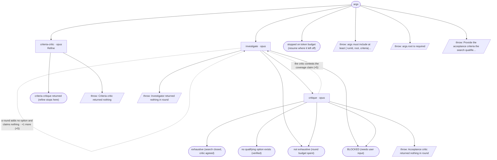

# investigate-cycle — flow map

Generated by `node tools/gen-flows.mjs investigate` — **do not hand-edit**.
Every node and edge below was *observed*: the scenarios in `tools/flows/` run the real engine
under the test harness with scripted agent returns, so this is what a run does rather than what
it might do. `node tools/gen-flows.mjs --check` fails the gate while this file is stale.

## Phases

| Phase | What happens |
|---|---|
| Refine | MANDATORY first pass (refine phase only): an independent criteria critic reads the criteria and returns gaps, blocking questions, and any criterion no evidence could settle either way. Writes nothing. |
| Investigate | ONE investigator per round (sequential, which is what makes a single shared ledger safe): reads the criteria verbatim + the whole DISQUALIFIED.md ledger + the last critique, searches, self-checks every candidate against every criterion, writes options/&lt;id&gt;.md per qualifier, appends each reject to the ledger, and on a terminating round writes DETERMINATION.md with its coverage evidence. |
| Critique | Adversarial non-blind critic — skipped in a round that adds no option and claims no termination: verifies each new option against every criterion and each citation against its source, disqualifies what fails (appending to the same ledger), and attacks any exhaustion / no-solution claim. Agreement on a claim ends the loop; a contested claim buys another round. |

## Terminal states

| Terminal | Reached when | Source |
|---|---|---|
| criteria critique returned (refine stops here) |  | declared |
| exhaustive (search closed, critic agreed) |  | derived |
| no qualifying option exists (verified) |  | derived |
| not exhaustive (round budget spent) |  | derived |
| stopped on token budget (resume where it left off) |  | derived |
| BLOCKED (needs user input) |  | derived |
| throw: args must include at least { runId, root, criteria\|… |  | throw (line 30) |
| throw: args.root is required |  | throw (line 33) |
| throw: Provide the acceptance criteria the search qualifie… |  | throw (line 73) |
| throw: Criteria critic returned nothing |  | throw (line 289) |
| throw: Investigator returned nothing in round |  | throw (line 345) |
| throw: Acceptance critic returned nothing in round |  | throw (line 361) |

## Coverage

16 scenarios · 3/3 roles · 6/6 throw sites · 5/5 halt statuses · 12 terminal states.
