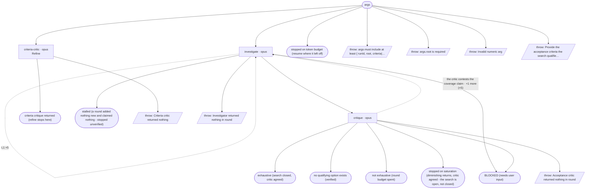

# investigate-cycle flow map

Generated by `node tools/gen-flows.mjs investigate`. **Do not hand-edit.**
Every node and edge below was *observed*: the scenarios in `tools/flows/` run the real engine
under the test harness with scripted agent returns, so this is what a run does rather than what
it might do. `node tools/gen-flows.mjs --check` fails the gate while this file is stale.

## Phases

| Phase | What happens |
|---|---|
| Refine | MANDATORY first pass (refine phase only): an independent criteria critic reads the criteria and returns gaps, blocking questions, and any criterion no evidence could settle either way. Writes nothing. |
| Investigate | ONE investigator per round (sequential, which is what makes a single shared ledger safe): reads the criteria verbatim + the whole DISQUALIFIED.md ledger + the last critique, searches, self-checks every candidate against every criterion, writes options/&lt;id&gt;.md per qualifier, appends each reject to the ledger (marking NEAR-MISS: the ones that failed exactly one criterion), and writes DETERMINATION.md - the options, a comparison over the axes they DIFFER on, which to pick when, the near misses and the coverage evidence - on a terminating round AND on the last round the budget allows, where it is labelled a partial result. |
| Critique | Adversarial non-blind critic - skipped only in a round that adds no option, claims no termination and owes no determination: verifies each new option against every criterion and each citation against its source, disqualifies what fails (appending to the same ledger), re-checks every NEAR-MISS marker, attacks any exhaustion / no-solution / saturation claim, and checks the determination when one was written. Agreement on a claim ends the loop; a contested claim buys another round. |

## Loops

| Loop | Agent | Repeats while |
|---|---|---|
| L1 | investigate | a round only rules candidates out · the investigator dies mid-search |

## Terminal states

| Terminal | Reached when | Source |
|---|---|---|
| criteria critique returned (refine stops here) |  | declared |
| exhaustive (search closed, critic agreed) |  | derived |
| no qualifying option exists (verified) |  | derived |
| not exhaustive (round budget spent) |  | derived |
| stopped on saturation (diminishing returns, critic agreed - the search is open, not closed) |  | derived |
| stalled (a round added nothing new and claimed nothing - stopped unverified) |  | derived |
| stopped on token budget (resume where it left off) |  | derived |
| BLOCKED (needs user input) |  | derived |
| throw: args must include at least { runId, root, criteria\|… |  | throw (line 30) |
| throw: args.root is required |  | throw (line 33) |
| throw: Invalid numeric arg |  | throw (line 54) |
| throw: Provide the acceptance criteria the search qualifie… |  | throw (line 96) |
| throw: Criteria critic returned nothing |  | throw (line 424) |
| throw: Investigator returned nothing in round |  | throw (line 490) |
| throw: Acceptance critic returned nothing in round |  | throw (line 531) |

## Coverage

20 scenarios · 3/3 roles · 7/7 throw sites · 7/7 halt statuses · 15 terminal states.
