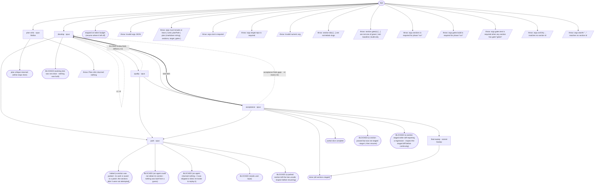

# migrate-cycle flow map

Generated by `node tools/gen-flows.mjs migrate`. **Do not hand-edit.**
Every node and edge below was *observed*: the scenarios in `tools/flows/` run the real engine
under the test harness with scripted agent returns, so this is what a run does rather than what
it might do. `node tools/gen-flows.mjs --check` fails the gate while this file is stale.

## Phases

| Phase | What happens |
|---|---|
| Refine | MANDATORY first pass (refine phase only): an independent critic greps the WHOLE change surface, verifies every section of the plan against real code, returns coverage gaps + blocking questions + too_big to the orchestrating agent. Writes nothing. |
| Develop | Developer reads the approved plan (verbatim) + its section + the latest review that flagged issues; implements ONLY that section minimally, runs the gate, leaves changes UNSTAGED. Owns the decision matrix; halts only for a user-only decision. |
| Quality | BLIND pure-code critic: reads ONLY the unstaged diff (no plan, no goal), flags production-blocking defects, writes quality-review-&lt;section&gt;-N.md. Must be clean to proceed. |
| Acceptance | Plan-aware section gate: every acceptance criterion of THIS section met + reachable + section gate green + no regression vs the staged baseline. Writes acceptance-review-&lt;section&gt;-N.md; on pass, STAGES the section (git add, never commit) - the baseline advances. |
| Park | On a section that did not accept within its round budget, or one the developer escalated: SAVES that section's work to parked-&lt;id&gt;.patch, then clears it from the tree so the repo is left clean and buildable. The run STOPS either way - the sections after it depend on this one landing - but nothing is destroyed: NEEDS-USER.md carries the restore command. |
| Sweep | After the FINAL section is staged: an independent agent re-greps the whole surface, runs the full gates, spot-checks the staged diff, writes SWEEP.md. The only whole-goal completeness check. |

## Loops

| Loop | Agent | Repeats while |
|---|---|---|
| L1 | develop | the section gate is never green |

## Terminal states

| Terminal | Reached when | Source |
|---|---|---|
| plan critique returned (refine stops here) | phase:"refine" | declared |
| done (all sections staged) | every section accepts and the sweep runs · the whole-goal sweep dies · finalSweep:false on a fully accepted run · the blind review finds defects · acceptance finds gaps · the developer changed no files | derived |
| partial slice complete | runOnly builds a subset of the sections | derived |
| halted (a section was parked - its work is saved to a patch; the sections after it were not attempted) | the section gate is never green · a section does not accept within its round budget | derived |
| BLOCKED (a section passed but was not staged - stage it, then resume) | acceptance passes without staging | derived |
| BLOCKED (a section staged while self-reporting a regression - inspect the staged diff before continuing) | acceptance stages while reporting a regression | derived |
| BLOCKED (an agent could not obtain its section - nothing was built from a guess) | the developer reports plan_obtained=false · the acceptance verifier reports plan_obtained=false | derived |
| BLOCKED (an agent returned nothing - it was skipped or died; re-invoke to replay it) | the developer agent dies · the blind quality reviewer dies · the acceptance verifier dies | derived |
| BLOCKED (working tree was not clean - nothing was built) | the tree was not clean on round 1 | derived |
| BLOCKED (needs user input) | the developer hits a user-only blocker | derived |
| BLOCKED (a parked section left the tree unsafe - inspect before resuming) | park could not clear the tree · park reports saved=false with bytes on disk · the build is red after parking | derived |
| stopped on token budget (resume where it left off) | too few tokens left to start a section | derived |
| throw: Invalid args JSON | args is a string that is not valid JSON | throw (line 30) |
| throw: args must include at least { runId, planPath \| plan (markdown string), sections, target, gates } | args carry neither runId nor a plan | throw (line 33) |
| throw: args.root is required | args.root is missing | throw (line 38) |
| throw: args.target.repo is required | args.target.repo is missing | throw (line 44) |
| throw: Invalid numeric arg | maxRounds is not a number | throw (line 65) |
| throw: section id(s) [...] are not kebab slugs | a sections entry id is not a kebab slug | throw (line 158) |
| throw: section gate(s) [...] are not one of green \| red-baseline \| build-only | a sections entry names an unknown gate | throw (line 171) |
| throw: Plan critic returned nothing | the plan critic dies | throw (line 605) |
| throw: args.sections is required for phase:"run" | every sections entry is missing its id | throw (line 635) |
| throw: args.gates.build is required for phase:"run" | args.gates.build is missing | throw (line 641) |
| throw: args.gates.test is required when any section has gate:"green" | a section asks for gate:"green" with no test command | throw (line 644) |
| throw: args.runOnly ... matches no section id | runOnly holds an unknown section id | throw (line 659) |
| throw: args.startAt "..." matches no section id | startAt is an unknown section id | throw (line 664) |

## Coverage

36 scenarios · 6/6 roles · 13/13 throw sites · 9/9 halt statuses · 25 terminal states.
