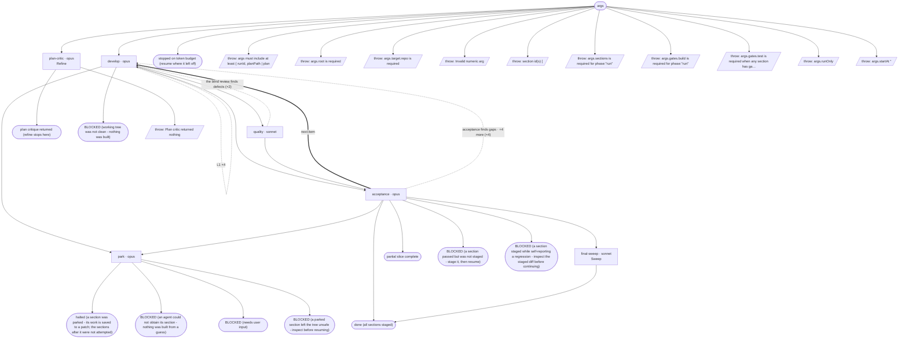

# migrate-cycle flow map

Generated by `node tools/gen-flows.mjs migrate`. **Do not hand-edit.**
Every node and edge below was *observed*: the scenarios in `tools/flows/` run the real engine
under the test harness with scripted agent returns, so this is what a run does rather than what
it might do. `node tools/gen-flows.mjs --check` fails the gate while this file is stale.

## Phases

| Phase | What happens |
|---|---|
| Refine | MANDATORY first pass (refine phase only): an independent critic greps the WHOLE change surface, verifies every section of the plan against real code, returns coverage gaps + blocking questions + too_big to the orchestrating agent. Writes nothing. |
| Develop | Developer reads the approved plan (verbatim) + its section + the latest review that flagged issues; implements ONLY that section minimally, runs the gate, leaves changes UNSTAGED. Owns the decision matrix; halts only for a user-only decision. |
| Quality | BLIND pure-code critic: reads ONLY the unstaged diff (no plan, no goal), flags production-blocking defects, writes quality-review-&lt;section&gt;-N.md. Must be clean to proceed. |
| Acceptance | Plan-aware section gate: every acceptance criterion of THIS section met + reachable + section gate green + no regression vs the staged baseline. Writes acceptance-review-&lt;section&gt;-N.md; on pass, STAGES the section (git add, never commit) - the baseline advances. |
| Park | On a section that did not accept within its round budget, or one the developer escalated: SAVES that section's work to parked-&lt;id&gt;.patch, then clears it from the tree so the repo is left clean and buildable. The run STOPS either way - the sections after it depend on this one landing - but nothing is destroyed: NEEDS-USER.md carries the restore command. |
| Sweep | After the FINAL section is staged: an independent agent re-greps the whole surface, runs the full gates, spot-checks the staged diff, writes SWEEP.md. The only whole-goal completeness check. |

## Loops

| Loop | Agent | Repeats while |
|---|---|---|
| L1 | develop | the section gate is never green |

## Terminal states

| Terminal | Reached when | Source |
|---|---|---|
| plan critique returned (refine stops here) |  | declared |
| done (all sections staged) |  | derived |
| partial slice complete |  | derived |
| halted (a section was parked - its work is saved to a patch; the sections after it were not attempted) |  | derived |
| BLOCKED (a section passed but was not staged - stage it, then resume) |  | derived |
| BLOCKED (a section staged while self-reporting a regression - inspect the staged diff before continuing) |  | derived |
| BLOCKED (an agent could not obtain its section - nothing was built from a guess) |  | derived |
| BLOCKED (working tree was not clean - nothing was built) |  | derived |
| BLOCKED (needs user input) |  | derived |
| BLOCKED (a parked section left the tree unsafe - inspect before resuming) |  | derived |
| stopped on token budget (resume where it left off) |  | derived |
| throw: args must include at least { runId, planPath \| plan |  | throw (line 26) |
| throw: args.root is required |  | throw (line 31) |
| throw: args.target.repo is required |  | throw (line 37) |
| throw: Invalid numeric arg |  | throw (line 58) |
| throw: section id(s) [ |  | throw (line 132) |
| throw: Plan critic returned nothing |  | throw (line 562) |
| throw: args.sections is required for phase:"run" |  | throw (line 592) |
| throw: args.gates.build is required for phase:"run" |  | throw (line 598) |
| throw: args.gates.test is required when any section has ga… |  | throw (line 601) |
| throw: args.runOnly |  | throw (line 616) |
| throw: args.startAt " |  | throw (line 621) |

## Coverage

31 scenarios · 6/6 roles · 11/11 throw sites · 8/8 halt statuses · 22 terminal states.
