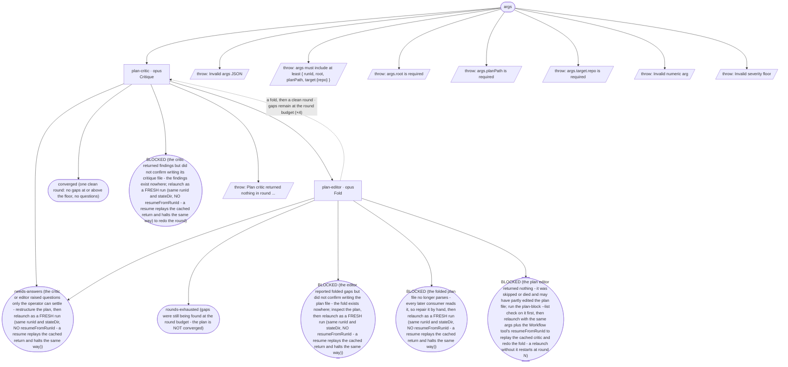

# refine-cycle flow map

Generated by `node tools/gen-flows.mjs refine`. **Do not hand-edit.**
Every node and edge below was *observed*: the scenarios in `tools/flows/` run the real engine
under the test harness with scripted agent returns, so this is what a run does rather than what
it might do. `node tools/gen-flows.mjs --check` fails the gate while this file is stale.

## Phases

| Phase | What happens |
|---|---|
| Critique | A read-only critic reads the plan file verbatim, greps the target repo, and judges every todo block against the defect bar and the severity floor. Writes plan-critique-&lt;round&gt;.md (gaps with file:line evidence, a below-floor FYI section, questions) and returns counts plus a wrote_file attestation, nothing else. |
| Fold | Runs only when the round returned at-or-above-floor gaps and no questions. The editor folds each gap into the plan file with the smallest edit that closes it, changes nothing a gap does not name, declines to DISMISSED-PLAN.md, and re-runs the plan-block tool to prove the file still parses. |

## Terminal states

| Terminal | Reached when | Source |
|---|---|---|
| converged (one clean round: no gaps at or above the floor, no questions) | the first critic finds nothing · a fold, then a clean round | derived |
| needs-answers (the critic or editor raised questions only the operator can settle - restructure the plan, then relaunch as a FRESH run (same runId and stateDir, NO resumeFromRunId - a resume replays the cached return and halts the same way)) | the critic raises a question · the editor escalates a contested dismissal | derived |
| rounds-exhausted (gaps were still being found at the round budget - the plan is NOT converged) | gaps remain at the round budget | derived |
| BLOCKED (the critic returned findings but did not confirm writing its critique file - the findings exist nowhere; relaunch as a FRESH run (same runId and stateDir, NO resumeFromRunId - a resume replays the cached return and halts the same way) to redo the round) | the critic reports findings it did not write | derived |
| BLOCKED (the editor reported folded gaps but did not confirm writing the plan file - the fold exists nowhere; inspect the plan, then relaunch as a FRESH run (same runId and stateDir, NO resumeFromRunId - a resume replays the cached return and halts the same way)) | the editor reports folds it did not write | derived |
| BLOCKED (the folded plan file no longer parses - every later consumer reads it, so repair it by hand, then relaunch as a FRESH run (same runId and stateDir, NO resumeFromRunId - a resume replays the cached return and halts the same way)) | the plan file stops parsing after the fold | derived |
| BLOCKED (the plan editor returned nothing - it was skipped or died and may have partly edited the plan file; run the plan-block --list check on it first, then relaunch with the same args plus the Workflow tool's resumeFromRunId to replay the cached critic and redo the fold - a relaunch without it restarts at round N) | the plan editor dies | derived |
| throw: Invalid args JSON | args is a string that is not valid JSON | throw (line 28) |
| throw: args must include at least { runId, root, planPath, target:{repo} } | args.runId is missing | throw (line 31) |
| throw: args.root is required | args.root is missing | throw (line 36) |
| throw: args.planPath is required | args.planPath is missing | throw (line 42) |
| throw: args.target.repo is required | args.target.repo is missing | throw (line 48) |
| throw: Invalid numeric arg | maxRounds is not a number | throw (line 61) |
| throw: Invalid severity floor | critiqueSeverity is outside blocking \| major \| minor | throw (line 72) |
| throw: Plan critic returned nothing in round ... | the plan critic dies | throw (line 285) |

## Coverage

17 scenarios · 2/2 roles · 8/8 throw sites · 7/7 halt statuses · 15 terminal states.
